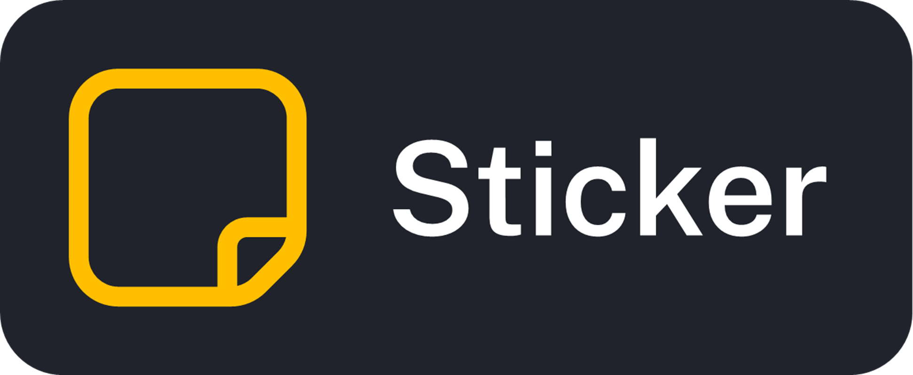

# Sticker

  

## What is Sticker?
Sticker is a productivity app designed to be:
- Easy to use
- Modular
- Customisable

> [!NOTE]  
> Sticker is still an early prototype! This means:
> - Some features may not work as expected (please report anything that doesn't work!)
> - Some features listed on this page may not exist yet

## Changelog (v0.3)
### v0.3
- Fixed bug in the to-do list which meant that to-dos would not stay as completed when the page reloaded
- Due dates now also show the day of the week

### v0.2
- Added sorting option to to-do list
- Done to-dos will now also show on the list
- Added new sidebar buttons, but they will not work

### v0.1
- Added basic todo app - you can create todos with a title and due date, as well as mark todos as done and delete them.
